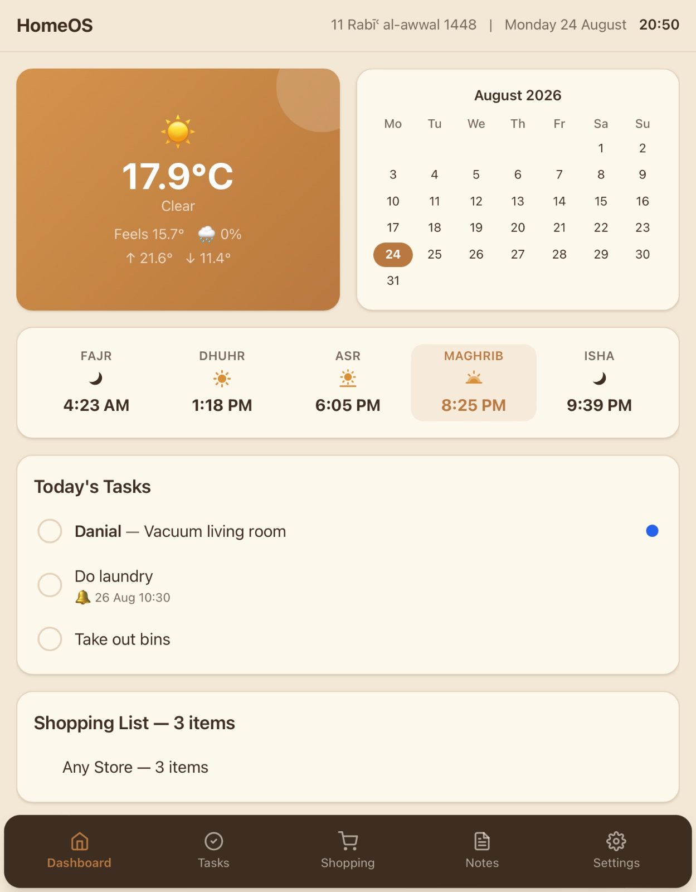
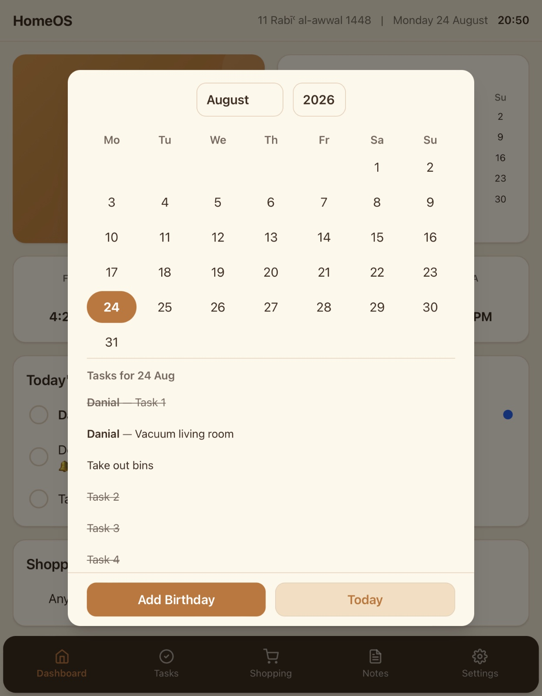
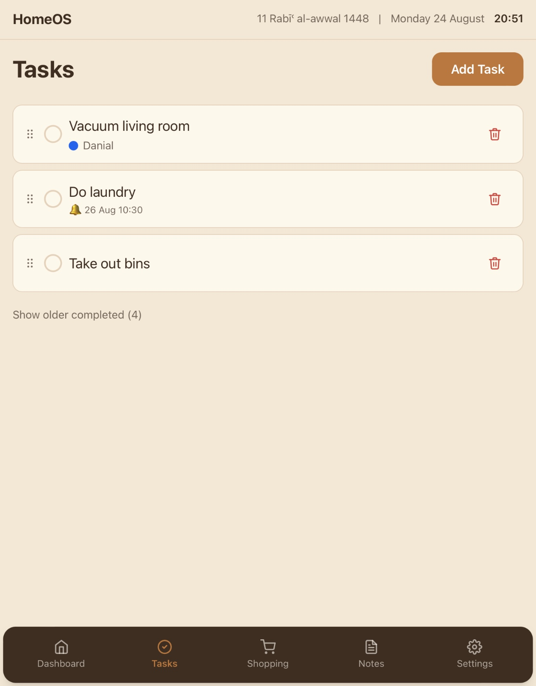
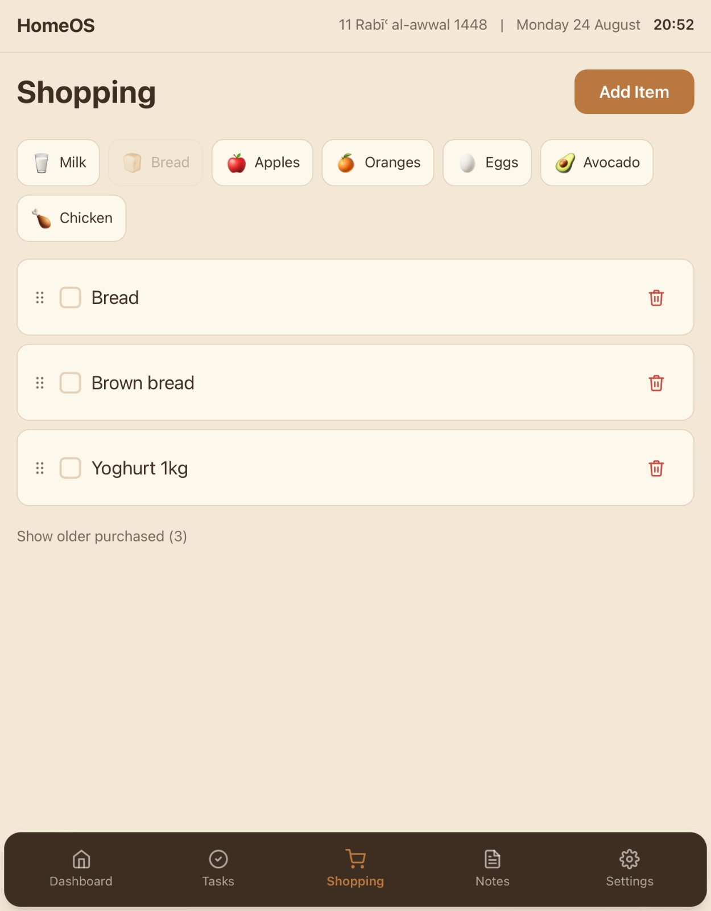
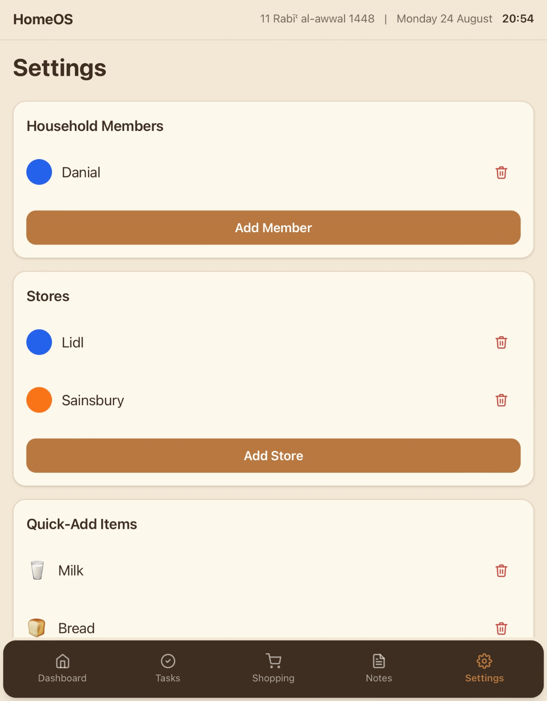

# HomeOS

A self-hosted family operating system for a kitchen touchscreen. Manages household tasks, shopping lists, notes, prayer times, and birthdays from a single shared display.

## Screenshots

<p align="center">
  
  
</p>

<p align="center">
  
  
</p>

<p align="center">
  
</p>

## Tech Stack

- **Frontend:** React, TypeScript, Vite, Tailwind CSS
- **Backend:** Python 3.12, FastAPI, SQLAlchemy, SQLite
- **Infrastructure:** Docker, Docker Compose
- **Target Device:** Linux Mini PC + touchscreen display

## Quick Start

```bash
git clone https://github.com/YOUR_USERNAME/HomeOS.git
cd HomeOS
cp .env.example .env
docker compose up --build
```

## Documentation

- [Deployment Guide](docs/DEPLOYMENT.md)
- [Development Guide](docs/DEVELOPMENT.md)
- [Contributing](CONTRIBUTING.md)
- [Changelog](CHANGELOG.md)

## License

MIT
